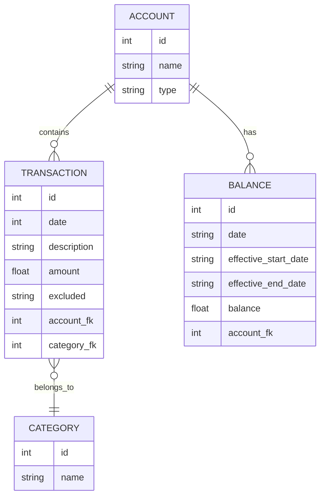

# Architecture

## Basic concepts

Intuit's Mint offered reporting on several personal finance aspects:
* List of all transactions across all accounts and financial institutions
* Assets, liabilities, and net worth over time
* Monthly spending by category, or by other dimensions
* Monthly spending over time
* 

While Mint was extremely useful, you only need two types of data to achieve
all of the reporting listed above. Namely, you need
* Every individual transaction. This provides the data needed for a searchable list of transcations, reporting on income/spending by category or other dimensions, and spending/income over time
* Balances for each account. This provides the data needed for tracking assets, liabilities, and net worth over time

By using these 2 data sets, Sage is much simpler than a true accounting 
application. We don't need to worry about double entry accounting, or keeping
a perfect ledger to calculate the current balance for an account. We simplify
the app by letting the financial institutions do the hard part, and Sage
will simply use the calculated balance (as part of the data provided in
statements from financial institutions) for reporting purposes.

## Entities and Relationships




## Dumping some SQL queries for doc purposes

```sql
-- balances definition
--
--CREATE TABLE balances_v2 (
--id int primary key,
--date text not null,
--effective_start_date text not null,
--effective_end_date text,
--amount real not null,
--account_id int not null,
--FOREIGN KEY (account_id) REFERENCES accounts (id) ON DELETE CASCADE 
--ON UPDATE NO ACTION
--);


-- get items in a SCD that have already started
--select id, effective_start_date , (effective_start_date < date('now')) AS beforenow from balances_v2;


-- get items in a SCD that have not yet expired
--select id, effective_end_date, ((effective_end_date > date('now')) or (effective_end_date is null)) AS afternow from balances_v2;

-- alternatively - look into setting a separate `current` column, but maybe this is just more work/state to manage
--select id, effective_start_date, effective_end_date from balances_v2 WHERE is_current=TRUE ;

```

