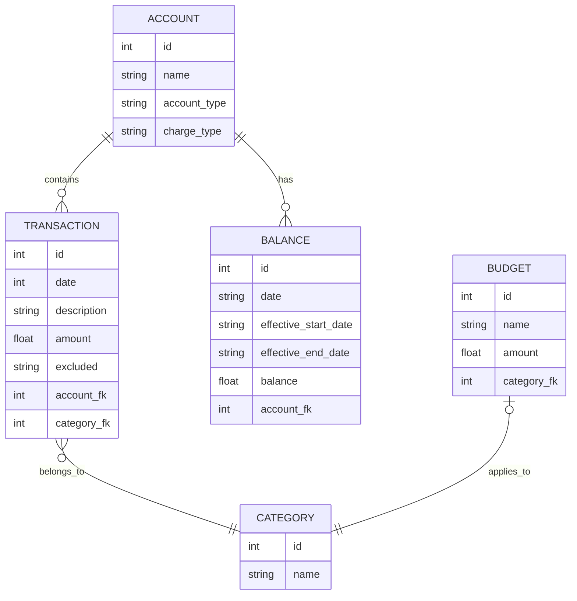
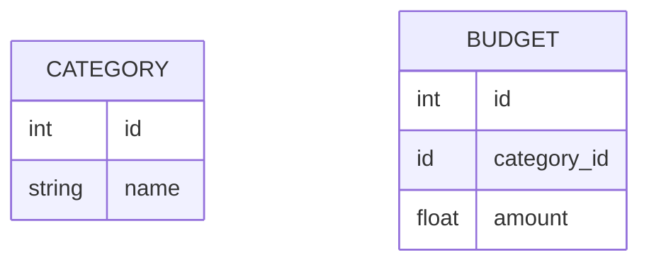

# Architecture

## Basic concepts

Intuit's Mint offered reporting on several personal finance aspects:
* List of all transactions across all accounts and financial institutions
* Assets, liabilities, and net worth over time
* Monthly spending by category, or by other dimensions
* Monthly spending over time
* Income over time
* Net income over time

While Mint was extremely useful, you only need two types of data to achieve
all of the reporting listed above. Namely, you need
* Every individual transaction. This provides the data needed for a searchable
list of transcations, reporting on income/spending by category or other
dimensions, and spending/income over time
* Balances for each account. This provides the data needed for tracking assets,
liabilities, and net worth over time

By using these two data sets, Sage is much simpler than a true accounting 
application. We don't need to worry about double entry accounting, or keeping
a perfect ledger to calculate the current balance for an account. Instead,
balances are treated as a separate data set that won't _necessarily_ reconcile
with transactions. As a reporting tool, this is a reasonable tradeoff.
While this simplifies the application logic, it puts the burden of recording
the balances on the end user.

## A note on balances

Statements from financial institutions don't perfectly align with the first and
last day of the month. For example, a statement may be for the period of March
15 to April 14. However, a balance is a snapshot in time - it is not a window
of time. A statement ending on April 14 shows the balance as of April 14.
Even though the balance is for a specific date, Sage (and humans in general)
consider this the balance for the month of April.

Sage treats balances as sparse data so that accounts don't need to be constantly
updated, especially accounts that don't change frequently (like your car or
house for example). To accomplish this, Sage will use the most recent balance
within a given timeframe. For example, if an account had a balance defined
for October 2 and October 17, the balance for October 17 would be displayed
when viewing the balance for October. If there is no balance newer than October
17, then Sage will show this same balance for November, December, and so on
until a newer balance is added.

Sage reports on balances by month and year ("year-months"), such as January
2024. To do this, Sage uses the following logic to group balances by month and
year:

1. Define all year-months requested in a report
1. Query the balances table for each year-month. The balance for a given
year-month is the balance with the most recent date that is before the end date
of the given month.

This captures all balances while handling discrepancies in when a balance
starts or ends.

## Entities and Relationships

Note: the ER diagram and SQL scripts are for illustrative purposes. Mermaid
doesn't support the same types as sqlite or Go, and the SQL scripts below
will be replaced by GORM.



## SQL queries for use cases

```sql
-- for the current month, show net income
WITH assest_increases as(
    SELECT sum(amount) as amount from transactions 
    where date >= '2024-06-01' and date < '2024-06-30'
    and account_id in (select id from accounts where charge_type='asset')
    and amount >= 0
),
assest_decreases as(
    SELECT sum(amount) as amount from transactions 
    where date >= '2024-06-01' and date < '2024-06-30'
    and account_id in (select id from accounts where charge_type='asset')
    and amount < 0
),
liability_increases as(
    SELECT sum(amount) as amount from transactions 
    where date >= '2024-06-01' and date < '2024-06-30'
    and account_id in (select id from accounts where charge_type='liability')
    and amount >= 0
),
liability_decreases as(
	SELECT sum(amount) as amount from transactions 
    where date >= '2024-06-01' and date < '2024-06-30'
    and account_id in (select id from accounts where charge_type='liability')
    and amount < 0
)

select COALESCE(ai.amount, 0) + COALESCE(ld.amount, 0) AS income, COALESCE(ad.amount, 0) + COALESCE(li.amount, 0) AS expenses
from assest_increases ai join assest_decreases ad join liability_increases li join liability_decreases ld;

-- show net income by month
-- using same `WITH` common table expressions as prevous example...
select COALESCE(ai.amount, 0) + COALESCE(ld.amount, 0) AS income, COALESCE(ad.amount, 0) + COALESCE(li.amount, 0) AS expenses, strftime('%Y-%m') as yearmonth
from assest_increases ai join assest_decreases ad join liability_increases li join liability_decreases ld
GROUP BY yearmonth;


-- get balances (as a SCD) that have already started
SELECT id, effective_start_date , (effective_start_date < date('now')) AS balance_started from balances WHERE balance_started=1;


-- get balances (as a SCD) that have not yet expired
SELECT id, effective_end_date, ((effective_end_date > date('now')) or (effective_end_date is null)) AS balance_not_ended from balances WHERE balance_not_ended=1;

-- combine the two to get active balances
WITH started AS (
    SELECT * , (effective_start_date < date('now')) AS balance_started from balances WHERE balance_started=1
),
not_ended AS (
    SELECT *, ((effective_end_date > date('now')) or (effective_end_date is null)) AS balance_not_ended from balances WHERE balance_not_ended=1   
)
SELECT s.id, s.amount FROM started s JOIN not_ended n ON s.id=n.id;

```


## Importing data

1. User clicks on "Import statement" in the UI. An import form is presented,
with a file picker and a submit button.
1. On submit, the file is POSTed to an endpoint. This endpoint calls a service
class.
1. The service class hashes the file. It then checks if the hash already exists
in the `statementSubmissions` table. If it finds a matching hash, it rejects
the statement because it has already been processed
1. Service class invokes a parser function, getting a list of transactions and
balances in return. For each transaction, compute a hash of the account ID,
amount, date, and description. 

## Budgets

A budget can be defined for any particular category or for all categories. By
defining a budget on all categories, this provides a total spending budget.

A budget has a per-month limit.



This model will allow us to handle the following use cases:

```sql
-- Get all budgets
SELECT * FROM BUDGET;

-- Get any budget that has been exceeded
SELECT SUM(AMOUNT) as total_spend
FROM transactions
WHERE category_id = 1
AND total_spend > (
    SElECT amount 
    FROM budgets
    WHERE category_id = 1
)
```

## SEMVER

Once a stable version is released, the project will treat any breaking change to any public interface (either JSON APIs or database schema) as a breaking change.