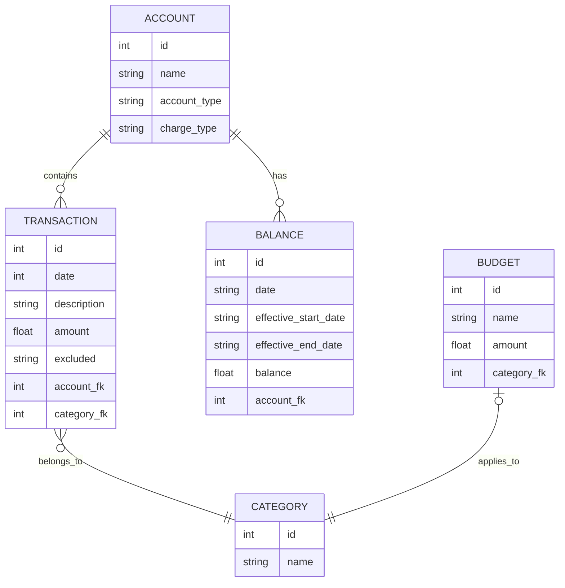

# Architecture

## Basic concepts

Intuit's Mint offered reporting on several personal finance aspects:
* List of all transactions across all accounts and financial institutions
* Assets, liabilities, and net worth over time
* Monthly spending by category, or by other dimensions
* Monthly spending over time
* Income over time
* Net income over time

While Mint was extremely useful, you only need two types of data to achieve
all of the reporting listed above. Namely, you need
* Every individual transaction. This provides the data needed for a searchable list of transcations, reporting on income/spending by category or other dimensions, and spending/income over time
* Balances for each account. This provides the data needed for tracking assets, liabilities, and net worth over time

By using these 2 data sets, Sage is much simpler than a true accounting 
application. We don't need to worry about double entry accounting, or keeping
a perfect ledger to calculate the current balance for an account. We simplify
the app by letting the financial institutions do the hard part, and Sage
will simply use the calculated balance (as part of the data provided in
statements from financial institutions) for reporting purposes.

## A note on balances

Statements from financial institutions don't perfectly align with the first and
last day of the month. For example, a statement may be for the period of March
15 to April 14. Sage also supports open-ended balances, for infrequently
updated assets (like your car or house for example). In these cases, a start
date for the balance is defined, but not an end date.

Sage reports on balances by month and year, such as January 2024. To do this,
Sage uses the following logic to group balances by month and year:

1. Select all months requested in a report, using either a one-off calculation
or a date dimension table (TBD).
1. Join this data on all balances where the balance's start date is before the
last day of the given month, and the end date is after the first day of the
month (or null).

This captures all balances while handling discrepancies in when a balance
starts or ends. Note that this does create the possibility of double counting
balances for a particular account, if more than one balance meets the above
criteria.

## Entities and Relationships

Note: the ER diagram and SQL scripts are for illustrative purposes. Mermaid
doesn't support the same types as sqlite or Go, and the SQL scripts below
will be replaced by GORM.



## SQL queries for use cases

```sql
-- for the current month, show net income
WITH assest_increases as(
    SELECT sum(amount) as amount from transactions 
    where date >= '2024-06-01' and date < '2024-06-30'
    and account_id in (select id from accounts where charge_type='asset')
    and amount >= 0
),
assest_decreases as(
    SELECT sum(amount) as amount from transactions 
    where date >= '2024-06-01' and date < '2024-06-30'
    and account_id in (select id from accounts where charge_type='asset')
    and amount < 0
),
liability_increases as(
    SELECT sum(amount) as amount from transactions 
    where date >= '2024-06-01' and date < '2024-06-30'
    and account_id in (select id from accounts where charge_type='liability')
    and amount >= 0
),
liability_decreases as(
	SELECT sum(amount) as amount from transactions 
    where date >= '2024-06-01' and date < '2024-06-30'
    and account_id in (select id from accounts where charge_type='liability')
    and amount < 0
)

select COALESCE(ai.amount, 0) + COALESCE(ld.amount, 0) AS income, COALESCE(ad.amount, 0) + COALESCE(li.amount, 0) AS expenses
from assest_increases ai join assest_decreases ad join liability_increases li join liability_decreases ld;

-- show net income by month
-- using same `WITH` common table expressions as prevous example...
select COALESCE(ai.amount, 0) + COALESCE(ld.amount, 0) AS income, COALESCE(ad.amount, 0) + COALESCE(li.amount, 0) AS expenses, strftime('%Y-%m') as yearmonth
from assest_increases ai join assest_decreases ad join liability_increases li join liability_decreases ld
GROUP BY yearmonth;


-- get balances (as a SCD) that have already started
SELECT id, effective_start_date , (effective_start_date < date('now')) AS balance_started from balances WHERE balance_started=1;


-- get balances (as a SCD) that have not yet expired
SELECT id, effective_end_date, ((effective_end_date > date('now')) or (effective_end_date is null)) AS balance_not_ended from balances WHERE balance_not_ended=1;

-- combine the two to get active balances
WITH started AS (
    SELECT * , (effective_start_date < date('now')) AS balance_started from balances WHERE balance_started=1
),
not_ended AS (
    SELECT *, ((effective_end_date > date('now')) or (effective_end_date is null)) AS balance_not_ended from balances WHERE balance_not_ended=1   
)
SELECT s.id, s.amount FROM started s JOIN not_ended n ON s.id=n.id;

```

